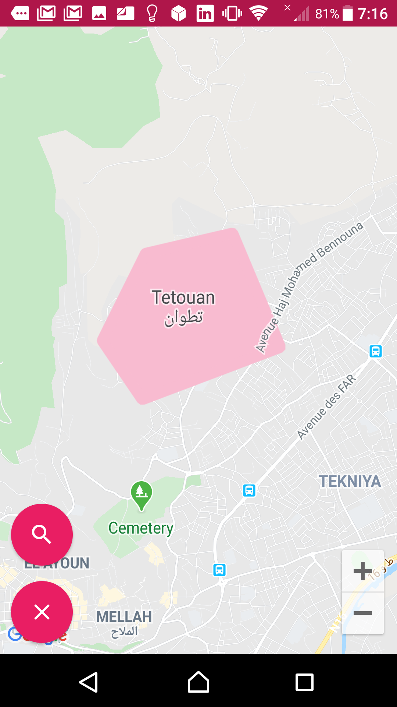
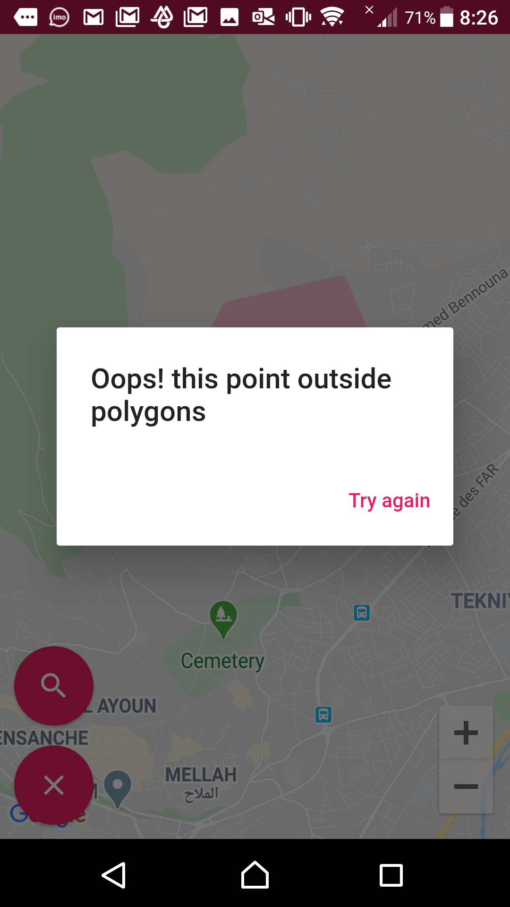
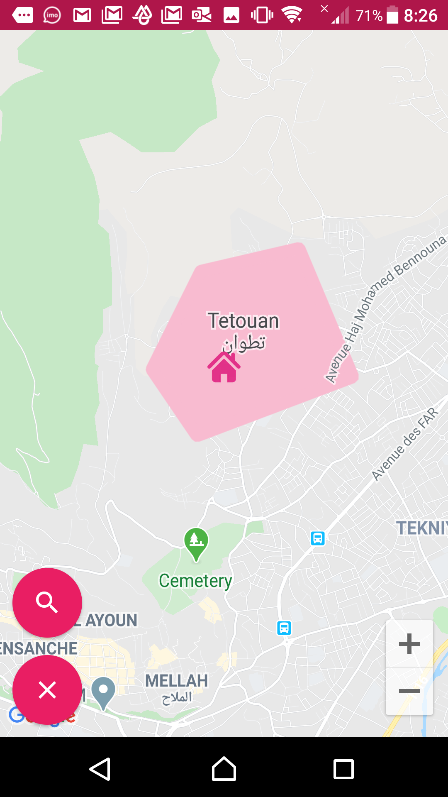
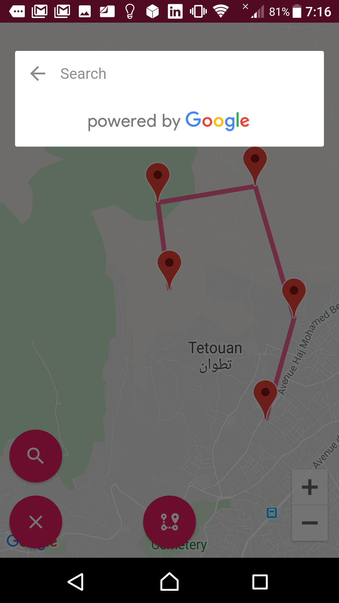
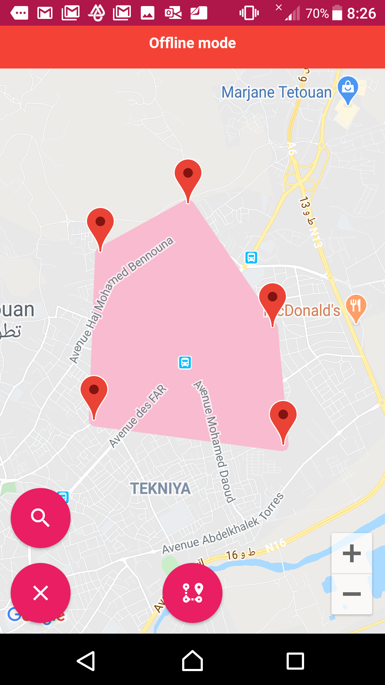
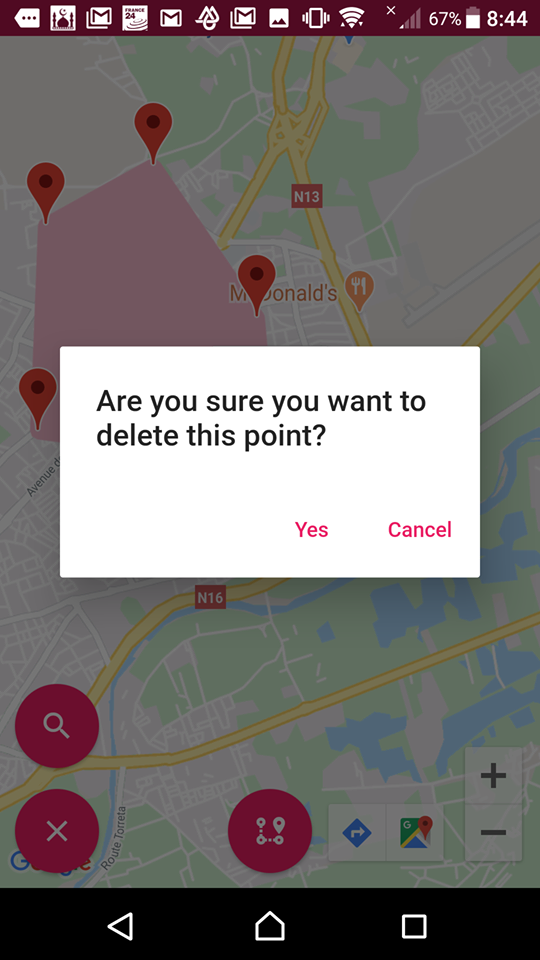
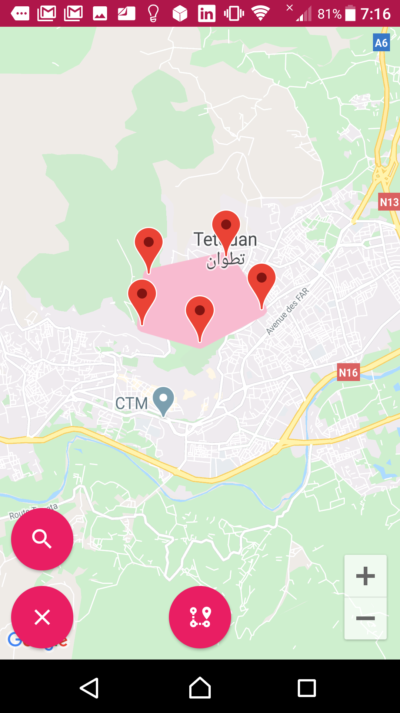
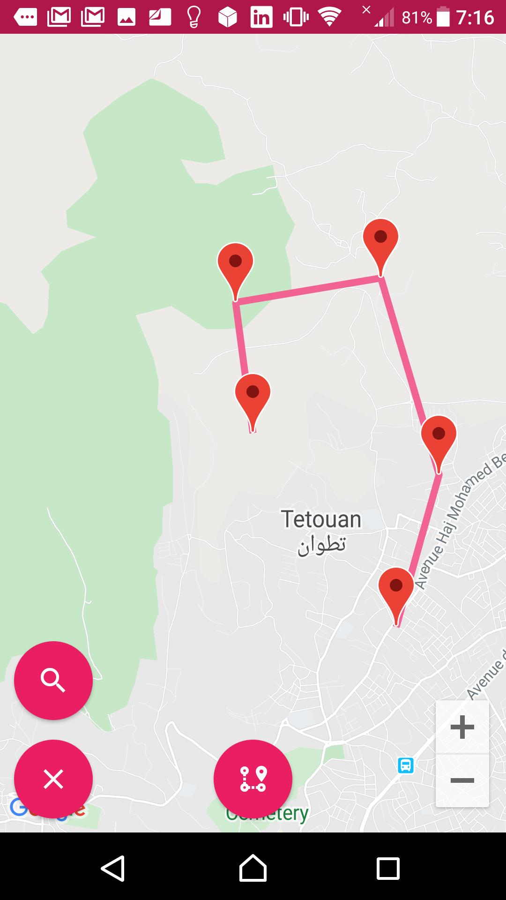

# challengesanadtech

Setup: First you should add your GOOGLE API KEY inside Manifest.xml and All Pages

Challenge: Develop a Mobile - App for Android that supports creating (CRUD) one or many geofences (polygons) and place/remove geo markers on the same Map. The app should prevent and warn the end-user if two or more polygons are overlapping or if he's trying to add a marker outside the defined polygons. If the App is closed and reopened the end-user should find all the polygons and markers previously defined before the app was closed.

## Getting Started

This project is a starting point for a Flutter application.

A few resources to get you started if this is your first Flutter project:

- [Lab: Write your first Flutter app](https://flutter.dev/docs/get-started/codelab)
- [Cookbook: Useful Flutter samples](https://flutter.dev/docs/cookbook)

For help getting started with Flutter, view our
[online documentation](https://flutter.dev/docs), which offers tutorials,
samples, guidance on mobile development, and a full API reference.
